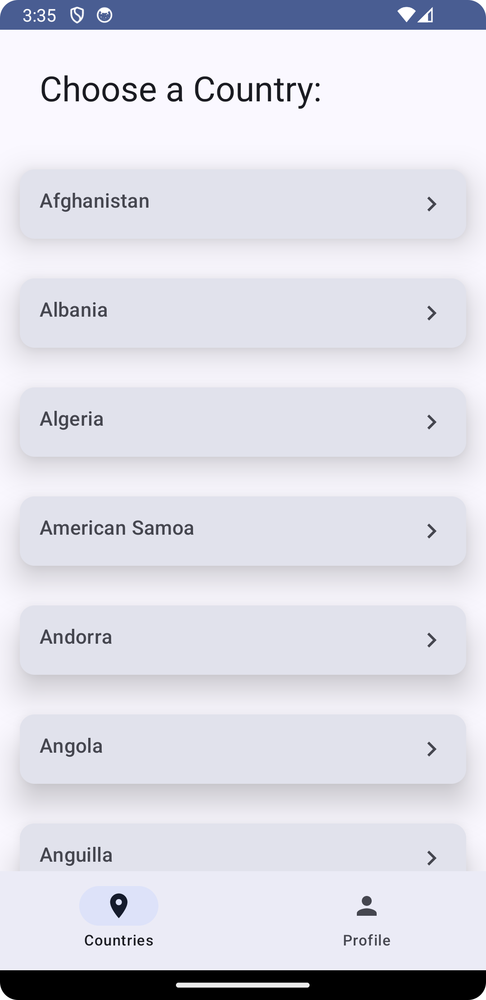
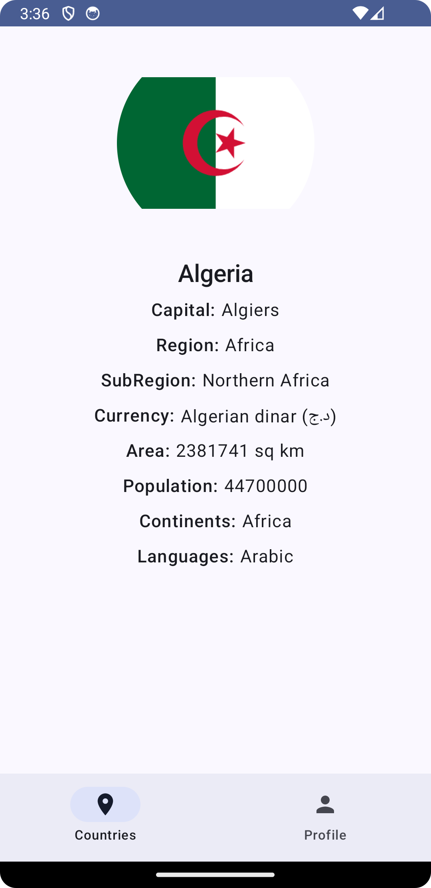

# CountriesApp

## Overview

CountriesApp is an Android application that allows users to view their profiles, browse a list of countries, and view detailed information about each country. Built with modern Android development tools, it follows the MVVM and Clean Architecture principles and is designed to provide a robust, maintainable, and scalable codebase.

## Features

-   **Profile Detail**: Users can display a profile with their name, a picture, and a summary of their education and work experience.
-   **Countries List**: A comprehensive list of countries is available to browse through.
-   **Country Detail**: Detailed information about each country, including capital, population, area, region, and sub-region, is fetched using HTTP GET requests.

## Architecture & Design

### Clean Architecture

The app is structured around Clean Architecture principles, separating concerns into distinct layers:

-   **Data**: Manages data sources and handles API responses and error scenarios. For example, `CountriesRepositoryImpl` implements methods to retrieve country details and handle exceptions gracefully.
-   **Domain**: Contains business logic. Use cases like `GetCountryDetailUseCase` encapsulate the operations for fetching detailed country information.
-   **Presentation**: Handles UI and presentation logic, utilizing state classes like `CountryDetailUiState` to manage UI state.

### MVVM

In the MVVM architectural pattern, each screen is backed by a ViewModel which exposes state and logic:

-   **ViewModels**: `CountryDetailViewModel` manages the UI state and invokes use cases to load data. It publishes `CountryDetailUiState` objects representing loading, success, and error states.
-   **UI States**: `CountryDetailUiState` sealed class enables strong typing of the UI state, facilitating the representation of different states like loading, success with data, or error with a message.

### Multi-Module Approach

Our app is modularized into feature and core modules, promoting separation of concerns and reusability.

## Technologies

-   **Kotlin Coroutines and Flows**: For asynchronous programming and reactive data handling.
-   **Hilt**: For dependency injection.
-   **Retrofit and Moshi**: For network operations and JSON parsing.
-   **Jetpack Compose**: For building the UI.
-   **Material3**: For theme and typography according to Material Design guidelines.
-   **Coil**: For image loading.
-   **Timber**: For logging.

## Data Handling

Data handling is a critical aspect of the application. The repository pattern is implemented to abstract the data source from the rest of the app. Repositories provide a clean API for data access to the rest of the application.

## Error Handling

The application is equipped with robust error handling mechanisms. When a network or data fetch operation fails, the repositories return a `Result` object that encapsulates the error, which the ViewModel processes and converts into an appropriate UI state.

## Testing

Unit tests are provided for ViewModel logic, use cases, and repository interactions, ensuring reliability and maintainability.

## Getting Started

1.  Clone the repository:

    `git clone https://github.com/yourusername/CountriesApp.git`

2.  Open the project in Android Studio.
3.  Build and run the application.

## Navigation

Navigation between screens is handled by the `AppNavigation` class using Jetpack Compose Navigation.

## API References

-   List of countries XML: [Ultimate String Array List - Countries.xml](https://github.com/vinaygaba/Ultimate-String-Array-List/blob/master/Countries.xml)
-   Country details API: [REST Countries](https://restcountries.com/#api-endpoints-v3-all)

## Screenshots

### Profile Screen 

### Countries List 

### Country Detail Screen 